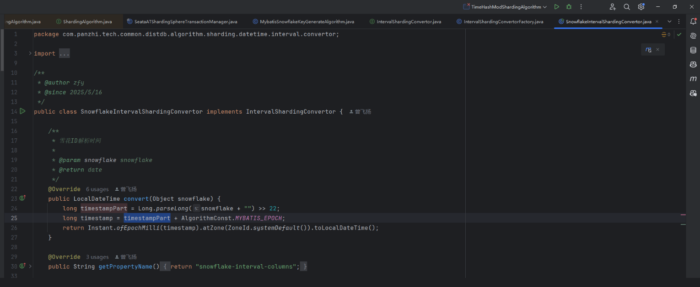
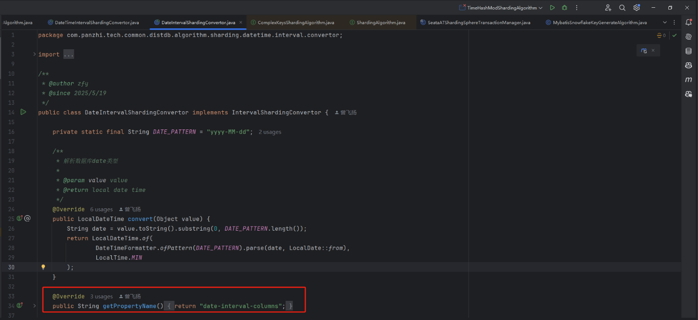
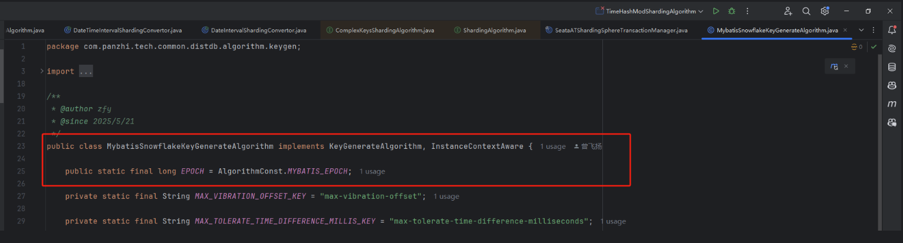

# 背景
按创建时间分表业务场景下，updateById或getById都无法命中分表键，实现只有ID条件也能路由至分表。
- 思考：ID字段是由雪花算法生成可逆向反推出创建时间，再路由至对应分表。
  - 方案一：业务侧解析ID，手动拼接创建时间查询条件。缺点：业务侵入性较大。
  - 方案二：ShardingSphere侧解析ID，路由至对应分表。业务零侵入。
- 调研：ShardingSphere提供自定义分表算法，复合分表算法可支撑此场景。
  - SS提供SPI机制，代理模式会自动加载/opt/shardingsphere-proxy/lib或ext-lib下所有jar包。
  - 实现ComplexKeysShardingAlgorithm接口自定义分表算法。
  - 实现KeyGenerateAlgorithm接口自定义ID生成算法。
# 源码解析
1. 自定义复合分表算法COMPLEX_INTERVAL

2. 自定义列转换器：列的值->时间

扩展：支撑列按自定义规则解析成时间，如订单号。
3. 自定义ID生成算法MYBATIS_SNOWFLAKE

- 说明：模拟SS默认SnowflakeKeyGenerateAlgorithm算法，修改EPOCH雪花起始时间为Mybatis时间。
- 原因：SS默认雪花算法起始与Mybatis不一致，导致生成ID时间不统一无法解析。
  - SS默认雪花ID：1132469635912830977，集群模式下workid生成依赖zk。
  - Mybatis雪花ID：1924427680002002946
# 使用说明
## SS分表配置
1. 分表算法：COMPLEX_INTERVAL
~~~
shardingAlgorithms:
  # 分表算法名称，一个type对应多实例，禁止多分表共用同一分表算法配置。
  t_goods_bargain_im_complex_interval:
    props:
      # 对应DateIntervalShardingConvertor转换器
      date-interval-columns: create_time
      # 对应SnowflakeIntervalShardingConvertor转换器
      snowflake-interval-columns: id
    # 对应ComplexIntervalShardingAlgorithm分表算法
    type: COMPLEX_INTERVAL
~~~
2. ID生成算法：MYBATIS_SNOWFLAKE
~~~
keyGenerators:
  # 默认雪花ID算法名称
  snowflake:
    # 对应SnowflakeKeyGenerateAlgorithm算法
    type: SNOWFLAKE
  # Mybatis雪花ID算法名称
  mybatis_snowflake:
    # 对应MybatisSnowflakeKeyGenerateAlgorithm算法
    type: MYBATIS_SNOWFLAKE

~~~
3. 分表策略配置
~~~
tableStrategy:
  complex:
    # 分表算法名称
    shardingAlgorithmName: t_goods_bargain_im_complex_interval
    # 复合分表列
    shardingColumns: id,create_time
~~~
4. 完整案例
~~~
databaseName: distributed_db
dataSources:
  g_0:
    password: xxx
    url: jdbc:mysql://ip:port/db
    username: root
    minPoolSize: 20
    connectionTimeoutMilliseconds: 30000
    maxLifetimeMilliseconds: 2100000
    readOnly: false
    idleTimeoutMilliseconds: 60000
    maxPoolSize: 50
rules:
- !SHARDING
  keyGenerators:
    snowflake:
      type: SNOWFLAKE
    mybatis_snowflake:
      type: MYBATIS_SNOWFLAKE
  shardingAlgorithms:
    t_goods_bargain_im_complex_interval:
      props:
        date-interval-columns: create_time
        snowflake-interval-columns: id
      type: COMPLEX_INTERVAL
  tables:
    t_goods_bargain_im:
      actualDataNodes: g_0.t_order_${2025..2026}${(1..12).collect{t
        ->t.toString().padLeft(2,'0')}}
      keyGenerateStrategy:
        column: id
        keyGeneratorName: mybatis_snowflake
      logicTable: t_goods_bargain_im
      tableStrategy:
        complex:
          shardingAlgorithmName: t_goods_bargain_im_complex_interval
          shardingColumns: id,create_time

~~~

# Mybatis使用
~~~
public class GoodsBargainImEntity {
    @TableId(value = "id", type = IdType.ASSIGN_ID)
    private Long id;
}
~~~
- 说明：ID生成策略必须指定为IdType.ASSIGN_ID雪花ID
- 原因：官方说明SS-PROXY在Mybatis保存Entity后不会自动回填主键字段。
  - 如需自动回填，请使用 ShardingSphere-JDBC，或者自行在业务侧生成 ID。
  - ShardingSphere-JDBC: 是一个 Java 库，在 Java 代码层面拦截和增强 JDBC 操作，所以能获取到 getGeneratedKeys()，回填主键 ID 到你的 Java 对象。
  - ShardingSphere-Proxy: 是 独立运行的代理服务，像一个中间数据库服务器，前端是你的应用连接它，后端是它转发到真正的数据库。